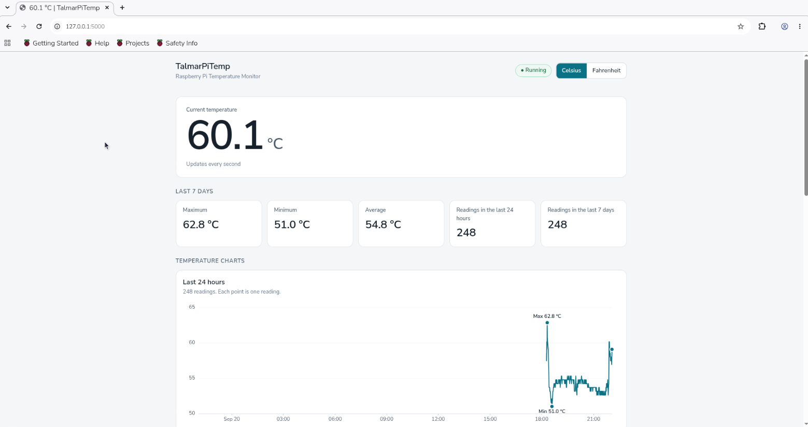

> [!WARNING]
> TalmarPiTemp is in early development and bugs are expected. If you find one, please report it (see [Contributing](#contributing)).

<p align="center">
  
</p>

<p align="center">
  
</p>

**Contents**

- [Features](#features)
- [Requirements](#requirements)
- [Installation](#installation)
- [Running](#running)
- [Configuration](#configuration)
- [Command line arguments](#command-line-arguments)
- [CSV file](#csv-file)
  - [Choosing the location](#choosing-the-location)
  - [Format](#format)
- [Temperature units](#temperature-units)
- [The 7 day statistics](#the-7-day-statistics)
- [Web interface](#web-interface)
  - [Web settings](#web-settings)
- [Run at boot](#run-at-boot)
- [Raspberry Pi compatibility](#raspberry-pi-compatibility)
- [Network security considerations](#network-security-considerations)
- [Stopping](#stopping)
- [Tests](#tests)
- [Project layout](#project-layout)
- [Contributing](#contributing)

# TalmarPiTemp

A Raspberry Pi CPU temperature monitor. It reads the temperature every second, shows it live in the terminal and in a local web dashboard, and records readings to a CSV file at an interval you choose. Statistics and charts are always calculated from the CSV, so your history survives restarts.

## Features

- Live temperature in the terminal (refreshes in place) and in the browser, about once per second.
- Readings written to a CSV file every N seconds. The live display and the recording interval are independent.
- Maximum, minimum and average over the last 7 days, calculated from the CSV, not from the current session.
- Celsius and Fahrenheit. The CSV always stores Celsius.
- Web dashboard with statistics, three interactive charts (last 24 hours, last 7 days, history with a selectable range) and settings.
- No database and no third party packages. Standard library only.

## Requirements

- Raspberry Pi OS or any Linux system with Python 3.9 or newer. Designed to stay light enough for a Raspberry Pi 3B+.
- A web browser on the Pi to open the dashboard, or an SSH tunnel from another computer (see Web interface).

## Installation

Copy the project folder to the Pi, for example to `/home/pi/TalmarPiTemp`. There is nothing to install.

```bash
cd /home/pi/TalmarPiTemp
python3 monitor.py
```

## Running

```bash
python3 monitor.py
python3 monitor.py --interval 30
python3 monitor.py --unit F
python3 monitor.py --csv /home/pi/data/temperature.csv
python3 monitor.py --port 5000
python3 monitor.py --interval 60 --unit C --csv /home/pi/data/temperature.csv
```

The terminal shows a dashboard that refreshes in place:

```text
TalmarPiTemp
Raspberry Pi Temperature Monitor

Status: Running
Unit: Celsius

Current Temperature: 48.7 °C

Last 7 Days
Maximum: 67.4 °C
Minimum: 39.2 °C
Average: 51.8 °C

Recording Interval: 10 seconds
CSV Location: /home/pi/temperature/temperature.csv
Last Recorded: 12:34:50

Web Interface: http://127.0.0.1:5000

Press Ctrl+C to stop
```

## Configuration

Every setting has a default. Values are combined in this order, later ones winning: defaults, the saved settings file, the command line.

| Setting | Default | Allowed values |
|-|-|-|
| Recording interval | 10 seconds | whole seconds from 1 to 86400 |
| Temperature unit | Celsius | C or F |
| CSV file | `temperature.csv` next to `monitor.py` | any writable location |
| Web server port | 5000 | 1 to 65535 |

The saved settings file is `~/.config/talmarpitemp/config.json` (or `$XDG_CONFIG_HOME/talmarpitemp/config.json`). It is created in three ways:

- On the first run from a terminal, when no CSV location is known yet, you are asked for one. Press Enter to accept the default.
- When you change a setting in the web dashboard.
- With `python3 monitor.py --setup`, which asks for all four settings.

Command line values apply to that run only and are never saved. Invalid values are rejected with a clear message.

## Command line arguments

| Argument | Meaning |
|-|-|
| `--csv PATH` | CSV file to record to and read history from |
| `--interval SECONDS` | Seconds between recorded readings |
| `--unit C\|F` | Display unit. `celsius` and `fahrenheit` also work |
| `--port PORT` | Web server port |
| `--sensor PATH` | Read a file that holds the temperature in millidegrees Celsius instead of detecting a sensor |
| `--config PATH` | Use another settings file |
| `--setup` | Ask for the settings interactively and save them |
| `--no-display` | Do not draw the live terminal dashboard |
| `--version` | Print the version |

Without a terminal, for example under systemd, the dashboard is skipped automatically. Only a start line and any problems are printed.

## CSV file

### Choosing the location

Use `--csv`, the first run question, `--setup`, or the CSV field in the web dashboard. Examples:

```text
/home/pi/temperature/temperature.csv
/home/pi/data/pi_temperature.csv
/mnt/storage/temperature.csv
/media/pi/USB/temperature.csv
```

Rules:

- The name must end with `.csv`. A folder path uses `temperature.csv` inside that folder.
- Missing parent folders are created. Under `/media` and `/mnt` the mount point itself must already exist, so a missing USB drive never causes data to be written to the SD card.
- The location must be writable. A new file gets its header automatically.
- An existing file must already start with the header below. Other files are refused, so the app never appends to unrelated files.
- Changing the location never deletes or moves a file and never copies history on its own. In the web dashboard and in `--setup` you can choose to copy the old history into a new or empty file.

### Format

```csv
timestamp,temperature_c
2026-09-20 12:00:00,45.20
2026-09-20 12:00:10,46.10
2026-09-20 12:00:20,47.30
```

- Temperatures are always Celsius with two decimals, whatever unit is displayed.
- Timestamps are the local time of the Pi, formatted `YYYY-MM-DD HH:MM:SS`.
- Rows are appended and flushed to disk. A write that fails, for example on a full disk, is rolled back, so no half written row is left behind.
- Data is kept forever. Delete rows yourself, while the app is stopped, if you want to trim the file. Keep rows in chronological order.
- Malformed rows, blank lines and impossible values (outside -50 to 150 °C) are ignored.

## Temperature units

Celsius is the default. Fahrenheit uses `F = C * 9 / 5 + 32`. Choose the unit with `--unit` or the Celsius and Fahrenheit switch in the dashboard. The unit is shared by the terminal and every open browser, and it is saved. Statistics and chart values are converted for display only. The CSV is never changed.

## The 7 day statistics

Maximum, minimum, average and the reading counts use only rows from the CSV whose timestamp is within the previous 7 days, up to now. Rows that are older, in the future (for example after a clock change) or invalid are ignored. With no valid rows in that window the terminal and the dashboard show `No data`. The average is the plain mean of the recorded readings.

Only the end of the file is read for these numbers, so they stay quick with millions of rows, and they are kept up to date as new rows are written.

## Web interface

The dashboard runs alongside the terminal monitor and only listens on `127.0.0.1`. Open `http://127.0.0.1:5000` in a browser on the Pi. Several tabs can be open at once.

To view it from another computer, forward the port over SSH and open the address on your own computer:

```bash
ssh -L 5000:localhost:5000 pi@raspberrypi
```

then browse to `http://localhost:5000`.

It shows the current temperature and unit, the 7 day maximum, minimum and average, the number of readings in the last 24 hours and 7 days, the recording interval, CSV path, last recorded reading, monitoring uptime, temperature source, hostname and current time. The current temperature updates once per second without reloading the page.

Charts read the CSV. Hover, touch or use the arrow keys to see exact readings. The minimum and maximum are marked. The history chart has range presets, a custom range, and zoom by dragging (double click to reset). Long ranges are grouped into buckets, and the band shows the minimum to maximum inside each bucket.

### Web settings

- Celsius and Fahrenheit switch.
- Recording interval. It applies immediately, without a restart.
- CSV path. The new location is validated first, the app switches to it without stopping, and the old file is left alone. There is an option to copy the old history.

Changes are validated before they are applied and saved to the settings file.

## Run at boot

`deploy/talmarpitemp.service` is a systemd unit. Edit the user and paths, then:

```bash
sudo cp deploy/talmarpitemp.service /etc/systemd/system/
sudo systemctl daemon-reload
sudo systemctl enable talmarpitemp
sudo systemctl start talmarpitemp
journalctl -u talmarpitemp -f
```

## Raspberry Pi compatibility

No model is assumed. The temperature is read from `/sys/class/thermal/thermal_zone0/temp` when available. Otherwise another thermal zone whose type contains `cpu` is used, then `vcgencmd measure_temp`. If none works, the terminal and dashboard show a clear sensor error, nothing is recorded, and reading is retried every second. Use `--sensor PATH` for a different file.

Typical use is a few tens of MB of memory and very little CPU. Startup on a 78 MB CSV with 3 million rows needs only the last 7 days to be read. Long history ranges on very large files take longer, more so on a Pi 3B+.

## Network security considerations

- The web server never listens on a network address, so other devices cannot reach it directly. Public internet exposure is not possible by default.
- There is no login. Anyone who can open the dashboard, including through your SSH tunnel, can change the interval, unit and CSV path.
- Requests must carry a loopback `Host` header, and changes must be JSON with a loopback `Origin`. This blocks other web pages in the browser from driving the settings.
- A new CSV path must end with `.csv` and be new, empty or already in this format.
- Do not put the dashboard behind a reverse proxy or a port forward without adding your own authentication.

## Stopping

Press Ctrl+C in the terminal. The dashboard is restored, the web server and background threads are stopped, and the program exits with `Stopped.`. Under systemd, `sudo systemctl stop talmarpitemp` sends SIGTERM, which is handled the same way. Rows are already on disk when they are written.

## Tests

```bash
python3 -m unittest discover -s tests -t .
```

The tests use temporary files and a fake sensor. They do not need a Raspberry Pi.

## Project layout

```text
monitor.py              entry point
talmarpitemp/
  temperature.py        sensor detection, reading and unit conversion
  storage.py            CSV format, path validation, safe appending, copy
  history.py            fast reads of the CSV and the 7 day cache
  stats.py              7 day statistics and chart downsampling
  config.py             defaults, validation, settings file, arguments, setup
  engine.py             sampling, recording and runtime changes
  display.py            terminal dashboard
  web.py                local web server and JSON API
  static/               dashboard page, styles and chart code
deploy/                 systemd unit
tests/                  unit and end to end tests
```

## Contributing

Contributions are welcome. While the project is in early development, bug reports and tests on different Raspberry Pi models are especially useful.

- **Report a bug or suggest an idea:** open an issue. For a bug, say what you did, what you expected and what happened, and include your Raspberry Pi model, your Python version and any message shown by the app.
- **Send a change:** for anything bigger than a small fix, open an issue first so the approach can be agreed. Then fork the repository, make your change on a branch and open a pull request that explains what changed and why.
- **Test it:** run `python3 -m unittest discover -s tests -t .` before you submit, and add tests for new behavior.

Please keep to the project rules:

- Standard library only. No third party packages, no database and no third party JavaScript.
- Light enough for a Raspberry Pi 3B+. Reading the CSV must never scan the whole file for the 7 day statistics.
- The web server listens on `127.0.0.1` only.
- Code, comments and interface text are in English.
- Python 3.9 or newer, and tests written with `unittest` only.
